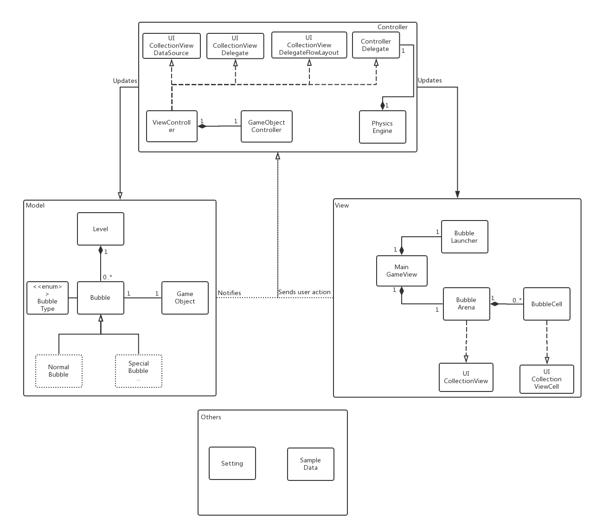

CS3217 Problem Set 4
==

**Name:** Niu Yunpeng

**Matric No:** A0162492A

**Tutor:** Louie Tan

## Tips

1. CS3217's Gitbook is at https://www.gitbook.com/book/cs3217/problem-sets/details. Do visit the Gitbook often, as it contains all things relevant to CS3217. You can also ask questions related to CS3217 there.
2. Take a look at `.gitignore`. It contains rules that ignores the changes in certain files when committing an Xcode project to revision control. (This is taken from https://github.com/github/gitignore/blob/master/Swift.gitignore).
3. A SwiftLint configuration file is provided for you. It is recommended for you to use SwiftLint and follow this configuration. Keep in mind that, ultimately, this tool is only a guideline; some exceptions may be made as long as code quality is not compromised.
    - Unlike previous problem sets, you are creating the Xcode project this time, which means you will need to copy the config into the folder created by Xcode and [configure Xcode](https://github.com/realm/SwiftLint#xcode) yourself if you want to use SwiftLint. 
4. Do not burn out. Have fun!

## Problem 1: Design

## Problem 1.1

_(Credit to [ProcessOn](https://www.processon.com/) for providing us with an excellent online tool to draw UML diagram)_

This `Bubble Hero Engine` application follows the MVC (_model, view, controller_) architecture. Each component is explained as follows:
- **Model**: The model provides a reliable backend store for all the data in the game. Similar to Problem Set 3, a `Level` is composed of
many `Bubble`s. By default, each `Level` has 12 rows, 11/12 columns of `FilledBubble`s. However, note that the `Level` class this type supports more functionalities compared to Problem Set 3. `Stack` is used to support some of these functionalities internally. In Problem Set 5, we may create subclasses for `FilledBubble` since there are special bubbles. Each `FilledBubble` has a `BubbleType`. For example, `FilledBubble`s of different colors are of different `BubbleType`s. Each object controlled by the `PhysicsEngine` must be a `GameObject`. A `GameObject` represents a simplified idealized physical object that obeys a certain subset of physics laws. In this problem set, it is a 2D object with no mass or volumn. However, it has a fixed size and its shape is a perfect circle. If its `isRigidBody` attribute is `true`, then it becomes a rigid body. Collision may happen between two rigid bodies. A `GameObject` can have speed and acceleration, both of which can be seen as a 2D vector. The `BubbleProvider` will continously generate random `BubbleType`, as a supplier for the bubble launcher.
- **Controller**: The `BubbleArenaController` is the main controller for the game view. To support `bubbleArena` which is a `UICollectionView`, this class will conform to `UICollectionViewDataSource`, `UICollectionViewDelegate` and `UICollectionViewDelegateFlowLayout` protocols. The `BubbleLauncherController` controls the related operations and user input about launching a bubble (using the bubble launcher at the middle bottom of the screen). After a bubble has been launched, the `ShootingBubbleController` will take over the control. It will work closely with `PhysicsEngine` and `GameObjectsController` to instruct the movement of shooted bubbles and detect collision. Whenver collision happens, the `PhysicsEngine` will inform `ShootingBubbleController` to handle the game-specific logic. `GameObjectsController` acts as a bridge and mapping between the `GameObject`s managed in the game engine and `FilledBubble`s stored in the model. For information passing and notification of events happened, delegate pattern is applied to the three main controllers. They conform to `BubbleArenaControllerDelegate`, `BubbleLauncherControllerDelegate` and `ShootingBubbleControllerDelegate` protocols respectively.
- **View**: The view in this problem set is pretty simple. It mainly consists of two parts, the `BubbleArena` and the `BubbleLauncher`. The `BubbleArena` is a `UICollectionView`, which is composed of many `BubbleCell`s, which conforms to the `UICollectionViewCell` protocol. The `BubbleLauncher` is simply a `UIImageVIew`, which shows the next bubble to be launched. Whenever the player shoots a bubble, it will be updated according to the supply from `BubbleProvider`.

_(The idea of rigid body & collision is adapted from [Unity3D game engine](https://docs.unity3d.com/2018.1/Documentation/ScriptReference/Rigidbody.html), although there are variations.)_

## Problem 1.2

Thanks to the flexible nature of the current design, more complex game logic can be supported easily. Notice that such kind of game logic is specific to this game. Thus, they should not be part of the game engine. Instead, they should be triggered when the `PhysicsEngine` notifies the `ShootingBubbleController` that a collision happens. When the `ShootingController` gets notified that a collision happens, it should show different behaviors according to the `BubbleType` of two parties of the collision.

If the `BubbleType` is just the normal colors, the behavior would be the same as the current one. If it is a special type, some special behaviors will be triggered. To support removal of all bubbles of a specific color, we just need to check whether the shooted bubble collides with this special type of `FilledBubble`. If so, we will let the model, the `Level` object finds all the `FilledBubble`s with the same color. After that, we will delete these bubbles from the model, reload these cells in the collection view, deregister the corresponding `GameObject`s from the physics engine (and also apply effects like _fading-away_).

## Problem 2.1

In the current design, the user can specify the angle to launch the bubble by single-tap on any position of the screen. However, notice that the single-tap must happen at which is at least slightly higher than the `BubbleLauncher` (because we only allow the user to launch bubbles upwards). After that, the position of the single-tap gesture will be computed relative to the position of the `BubbleLauncher`. After that, the angle will be calculated using `θ = atan(dy/dx)`. If `dy < 0` (which means the angle will be negative and the bubble will be shooted downwards), the input will not be accepted.

Then, we will create a `GameObject` whose intial position will be the same as `BubbleLauncher`. The magnitude of its speed will be a constant, while the angle changes according to the user input. This `GameObject` will be registered into the `PhysicsEngine`, which will in turn handle its movement and collision afterwards.

In the meantime, the `BubbleLauncher` will also be updated by asking `BubbleProvider` to supply it with the next randomly-generated bubble ready for launch.

## Problem 3: Testing

The strategy for testing this application is stated as follows:

#### Black-box testing

- Test the launch of a bubble
    - When I single-tap on a location of the screen that is not at least slighlt higher than the position of the bubble launcher, I expect the input is rejected and nothing will happen.
    - When I already have a shooted bubble travelling (collision not happened yet), I expect the input is rejected and nothing will happen.
    - Otherwise, I expect the bubble is launched in the direction towards the point of the single-tap gesture.
- Test the movement of a bubble
    - When a bubble has been launched (shooted) successfully, I expect the travelling speed to be a positive constant. I also expect the bubble travels in a staight line (as long as no collision with screen edge or other bubbles happen).
    - When a bubble is falling down, I expect it to be a free falling process (without the effect of air resistance), i.e., its acceleration is a positive constant. Visually, the velocity should increase. I also expect the falling down in straight downwards.
- Test collision between two bubbles
    - When a shooted bubble collides with a remaining static bubble, I expect the shooted bubble to stop moving and snap to the nearest empty cell.
    - Following above, when there are more than 3 connected bubbles of the same color, I expect them to be removed with a fading away effect.
    - Following above, when there are bubbles unattached to the top wall, I expect them to be removed by falling down out of the screen.
    - When a shooted bubble "collides" with a falling bubble, I expect no collision will happen and they will bypass each other.
- Test collision between a bubble and a screen edge
    - When a shooted bubble collides with the side wall (left or right), I expect a reflection happens. In other words, the (horizontal component of the) moving direction of the bubble should reverse.
    - When a shooted bubble collides with the top wall, I expect it to stop moving and snap to the nearest empty cell.
    - Following above, after snapping to the nearest empty cell, normal behavior should happen if it collides with any other static bubble.

#### Glass-box testing
- `BubbleArenaController`:
- `BubbleLauncherController`:
- `ShootingBubbleController`:
- `PhysicsEngine`:
- `GameObjectController`:
- `GameObject`:
- `Level`:
- `FilledBubble`:
- `BubbleType`:
- `BubbleProvider`:
- `BubbleCell`:
